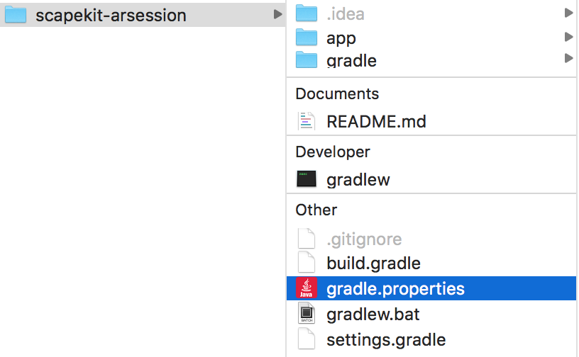

# ScapeKit 0.3.0 Samples for Android 

* Clone the repository
* Add `gradle.properties` file at the same level as your `build.gradle` project file 

</a>

* Then copy and paste:
```
ScapeKitApiKey=""
```

* Fill in the empty quotes with your actual `API_KEY` created on your developer dashboard

* Now you can deploy the application on your device
